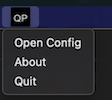
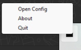

<p align="center">
  
</p>

# QueryPop 🎉

QueryPop is a Python application called with a hotkey, that sends selected text (or last from clipboard) to a Large Language Model (LLM) along with selected customizable inputs (selected from a pop-up) for processing and displays the response in a user-friendly pop-up window. Users can choose webversions of major LLM providers or use API key. This application is designed for macOS and Windows and provides functionality to handle text queries, display results, and save responses (when using API key). This avoids need to getting distracted from what your are reading. Read comprehensive [use cases](https://github.com/drankush/QueryPop/#-use-cases).

## ✨ Features 

- **Clipboard Integration**: Automatically copies selected text and processes it from the clipboard.
- **LLM Integration**: Sends text to a chosen Large Language Model by a provider (e.g., OpenAI) for processing. Accepts all OpenAI compatible API.
- **Web-LLM Services**: Supports most web-based LLM services, just sign-in into your account on Chrome browser.
- **Pop-Up Display**: Shows responses or errors in a graphical pop-up window.
- **Markdown to HTML**: Converts markdown responses to HTML for enhanced readability.
- **Response Saving**: Saves responses to a specified directory with timestamps.


## 🚀 Installation 

- Download the `.app` file for Mac or the `.exe` file for Windows from the [releases](https://github.com/drankush/QueryPop/releases).

##  ⚙️ Configuration

1. **API Details**: Set your API details in the `config.py` file. Accepts all OpenAI compatible API. You can open it by clicking ```Open Config``` in the tray icon.

   ```python
   OPENAI_API_URL = "https://api.openai.com/v1"
   OPENAI_API_KEY = "your_openai_api_key"
   MODEL = "gpt-4o"
   ```

2. **Instruction Prompt**: Customize the instruction prompts by modifying the `INSTRUCTION_PROMPT` variable in the `config.py` file. Take care of following the exact format as provided below.

   For example:
   ```python
    INSTRUCTION_PROMPTS = {
        0: "Key Points Extraction: 'Extract key points from the following text:'",
        1: "Summarization: 'Summarize the following text:'",
        2: "Translation: 'Translate the following text into English:'",
        3: "Explanation: 'Explain the following text in detail:'",
        4: "Question Answering: 'Answer the following question based on the text:'",
        5: "Question Generation: 'Generate Questions based on the text:'",
        6: "Paraphrasing: 'Paraphrase the following text:'",
        7: "Sentiment Analysis: 'Determine the sentiment of the following text:'",
        8: "Topic Modeling: 'Identify the topics in the following text:'",
        9: "Text Simplification: 'Simplify the following text for easier understanding:'",
        10: "Text Expansion: 'Expand the following text on the topic being discussed:'"
    
    }
   ```
3. **Appplication Shortcut**: You can set your own Appplication Shortcut. If you change the application shortcut, then you will have to restart the application to implement it.

   ```python
      APPLICATION_SHORTCUT = "<cmd>+'" # Command+ ' (the apostrophe) on macOS and Control+` (the backtick) on winOS
   ```

   - A list of available key names can be found [here](https://pynput.readthedocs.io/en/latest/keyboard.html#pynput.keyboard.Key).

*The v4 provides optional support to web-based LLM service. It expects users to have Chrome browser installed, logged in to their account and granted [permissions](https://github.com/drankush/QueryPop#-permissions) to accessibility features in built in OS. As you cannot automatically or programmatically extract data or output, this approach is completely compliant with TOS of all LLM service providers.*

4. **Preferred Web Version**: If instead of using API service, you wish to use the web version of LLM service you can input options for the supported services. Currently ```chatgpt```, ```claude```, ```gemini```, ```meta```, ```perplexity``` , ```mistral``` , ```blackbox``` , ```you``` are supported. Leave blank or set to any other value to use API keys.
   ```python
      PREFER_WEBVERSION = "chatgpt"
   ```  

5. **Input Delay for Web Version**: The application tries to input the selected text and the chosen custom intructions using accessibilty features in built in OS. You can change this value depending on your internet speed, after guaging how long the page takes to load.
   ```python
      INPUT_DELAY = "5"  # (in seconds)
   ```
   
6. **Browser Window Size**: This takes the format: {x-coordinate, y-coordinate, width, height}. For windows only height and width are used.

   ```python
      BROWSER_WINDOW_SIZE = "{100,50,400,700}" # Keep no spaces.
   ```


## 📋 Usage

1. **Run the Application:**
   - The application will listen in the background for you to press the shortcut key and will open the instruction prompt window.


2. **Edit ```config.py```:**
   - In the tray icon ```QP```, click  ```Open Config``` and enter your API Details, Instruction Prompts and desired Application Shortcut. Restart the application after saving the config.py file.
  
      <div style="display: flex; justify-content: center; align-items: center; flex-direction: column; text-align: center;">
        <div style="display: flex; justify-content: center; align-items: center; gap: 100px;">
          <div>
            
            <div><i>Mac Tray Icon</i></div>
          </div>
          <div>
            
            <div><i>Windows Tray Icon</i></div>
          </div>
        </div>
      </div>


     
3. **Select Text**: Select the text you wish to send with your prompt. Press your configured Shortcut Key. It will automatically copy the selected text.
   <p align="center">
     
   </p>

4. **Input the Instruction Prompt:**

   <p align="center">
     
   </p>
   
   - You can enter your custom prompt and press **OK**, which will be passed to the LLM along with your selected text in the clipboard.
   - You can press 0-9 keys on your keyboard which will pass that Instruction prompt mapped from the `config.py` along with the text in the clipboard.
   - Key bindings are available only from 0-9, if you have more instructions prompts, you will have to manually scroll and press the button.
   - If you wish to bypass this and want to hardcode a single instruction into the application, use `QueryPop v1`.
  
5. **Processing**: The application will automatically process the text and display `⚙️ Processing` in a pop-up window.
   <p align="center">
     
   </p>
6. **Final Output**: The application will display the result in the same pop-up window. It will also be copied to your clipboard which you can directly paste using Ctrl/Cmd+V.
   <p align="center">
     
   </p>


## 💡 Use Cases

QueryPop is a versatile tool that can significantly boost your productivity in various scenarios. 
- If you are using API the pop-up response is also returned to clipboard and can directly pasted (Cmd/Ctrl+V) in your application. 
- You can always customise your frequently used instruction prompt and write as detail as required.
- You can also choose enter your own prompt in the pop-up window.

*These are some of the use cases:*

1. **Instant Code Documentation**
   While coding, select a complex function or class and use QueryPop to generate comprehensive documentation. This can include explaining the purpose, parameters, return values, and potential edge cases, saving you time in writing detailed comments.

2. **Quick Language Translation**
   When reading articles or documents in a foreign language, highlight phrases or paragraphs and use QueryPop to get instant translations. This eliminates the need to switch between applications or browser tabs, maintaining your focus on the content. A great tool for language learners.

3. **Summarizing Long Articles**
   When faced with a lengthy article or report, select the entire text and use QueryPop to generate a concise summary. This allows you to quickly grasp the main points without reading the entire piece, perfect for research or staying updated in your field. Use prompts like "Create bullet points from this text" or "Summarize the main arguments."

4. **Explaining Complex Concepts**
   Encounter a difficult concept or technical term? Highlight it and use QueryPop to get a simplified explanation. This is particularly useful when reading academic papers or technical documentation, helping you understand complex ideas without extensive searching.

5. **Grammar and Style Improvements**
   While writing emails, reports, or articles, select paragraphs and use QueryPop to suggest grammar improvements or style enhancements. This acts as an instant writing assistant, helping you communicate more effectively without switching to dedicated grammar-checking tools.

6. **Generating Creative Ideas**
   When brainstorming for a project or content creation, use QueryPop to generate creative ideas based on your input. For example, enter a topic and ask for "10 unique blog post ideas about [topic]". This can help overcome writer's block and spark new perspectives.

7. **Quick Fact-Checking**
   While reading news articles or social media posts, highlight claims or statistics and use QueryPop to fact-check or provide additional context. This helps you stay informed and critical of the information you consume without disrupting your reading flow. Keep in mind AI can make mistakes.

8. **Code Debugging Assistant**
   When stuck on a coding problem, select the problematic code snippet and use QueryPop to get suggestions for debugging or optimization. While it won't replace thorough debugging, it can provide quick insights or point you in the right direction.

9. **Instant Research Assistance**
   While working on academic papers or reports, use QueryPop to quickly find relevant sources or additional information on a topic. Highlight key terms or research questions to get suggestions for further reading or potential citations (useful when used with LLMs who have web-access).

10. **Study Aid**
	Use QueryPop to create flashcards, concept maps, or study guides as you read your books, pdfs, research papers, making learning more efficient and effective. You can directly select all the text and ask it generate multiple choice questions, or other questions types for more comprehensive learning.

11. **Email and Message Crafting**

	You need to compose a professional email, or repititive mail. For example select the Order No and trigger the hotkey and then select predefined prompt button like "Write a email to John Doe LLC requesting for invoice for order no:". 

These use cases demonstrate how QueryPop can seamlessly integrate into your workflow, providing instant assistance and information across various tasks and domains, ultimately enhancing your productivity and efficiency.

## 🧷 Permissions

To ensure QueryPop works correctly, you need to grant it the necessary permissions on macOS. Follow these steps:

1. **Open the Apple Menu () and go to System Preferences.**
2. **Select Security & Privacy.**
3. **Click on the Privacy tab.**

### Input Monitoring
- **Purpose:** To monitor when the Shortcut key is pressed and the Instruction prompt window is opened.
- **How to Grant:**
  1. Scroll down and select **Input Monitoring** from the left-hand menu.
  2. Click the lock icon in the bottom left corner to enable changes. You may be prompted to enter your administrator password.
  3. Click the **+** button below the list of applications.
  4. In the file picker dialog, navigate to the QueryPop executable and select it.
  5. After adding QueryPop, you will see a warning popup. Choose **Quit & Restart** to apply the changes.
  6. Reopen QueryPop to continue using the application with the appropriate permissions.

### Accessibility
- **Purpose:** To simulate keystrokes in the Pop-up windows and to fetch selected text into the clipboard.
- **How to Grant:**
  1. Scroll down and select **Accessibility** from the left-hand menu.
  2. Click the lock icon in the bottom left corner to enable changes. You may be prompted to enter your administrator password.
  3. Click the **+** button below the list of applications.
  4. In the file picker dialog, navigate to the QueryPop executable and select it.
  5. After adding QueryPop, you will see a warning popup. Choose **Quit & Restart** to apply the changes.
  6. Reopen QueryPop to continue using the application with the appropriate permissions.

### Automation
- **Purpose:** To interact with web versions of LLMs through Google Chrome, Safari (for showing pop-ups), and System Events (for triggering AppleScript).
- **How to Grant:**
  - When you run QueryPop for the first time, you will receive prompts to grant access to **System Events**, **Google Chrome**, and **Safari**.
  - The prompt will say something like:
    ```
    "QueryPop" wants access to control "System Events". 
    Allowing control will provide access to documents and data in "System Events", and to perform actions within that app.
    ```
  - Click **OK** to grant the necessary permissions.
  - Ensure you do this for all the required applications when prompted.


## ❗ Error Handling

If no text is found in the clipboard, an error message will be displayed in a pop-up window. Errors related to the API will be displayed in the Processing window.

## 💾 Saving Responses

Responses are saved as `.txt` files in the directory as defined in `QueryPop/responses`. 
If the directory does not exist, it will be created automatically. Each file is named with a timestamp for easy tracking.

## 🤝 Contributing

Feel free to fork the repository and submit pull requests. If you encounter any issues or have suggestions for improvements, please open an [issue](https://github.com/drankush/QueryPop/issues).

##  📜 License

This project is licensed under the MIT License. See the [LICENSE](LICENSE) file for details.

