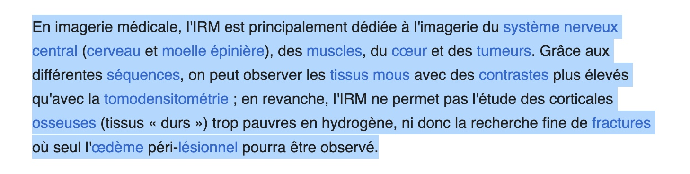
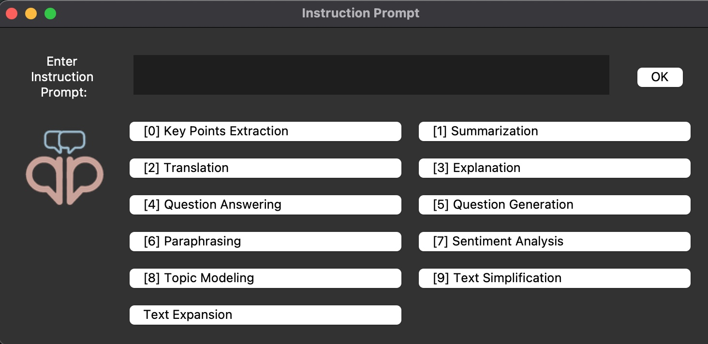
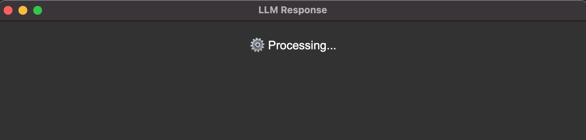
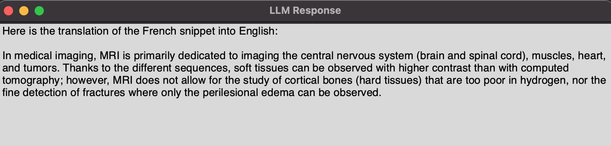

<p align="center">
  
</p>

# QueryPop 🎉

QueryPop is a Python application that sends selected text from the clipboard to a Large Language Model (LLM) along with user defined inputs for processing and displays the response in a user-friendly pop-up window. This application is designed for macOS and Windows and provides functionality to handle text queries, display results, and save responses. This avoids need to getting distracted from what your are reading.

## ✨ Features 

- **Clipboard Integration**: Automatically copies selected text and processes it from the clipboard.
- **LLM Integration**: Sends text to a chosen Large Language Model by a provider (e.g., OpenAI) for processing. Accepts all OpenAI compatible API.
- **Pop-Up Display**: Shows responses or errors in a graphical pop-up window.
- **Markdown to HTML**: Converts markdown responses to HTML for enhanced readability.
- **Response Saving**: Saves responses to a specified directory with timestamps.


## 🚀 Installation 

- Download the `.app` file for Mac or the `.exe` file for Windows from the [releases](https://github.com/drankush/QueryPop/releases).

##  ⚙️ Configuration

1. **API Details**: Set your API details in the `config.py` file. Accepts all OpenAI compatible API. You can open it by clicking ```Open Config``` in the tray icon.

   ```python
   OPENAI_API_URL = "https://api.openai.com/v1"
   OPENAI_API_KEY = "your_openai_api_key"
   MODEL = "gpt-4o"
   ```

2. **Instruction Prompt**: Customize the instruction prompts by modifying the `INSTRUCTION_PROMPT` variable in the `config.py` file. Take care of following the exact format as provided below.

   For example:
   ```python
    INSTRUCTION_PROMPTS = {
        0: "Key Points Extraction: 'Extract key points from the following text:'",
        1: "Summarization: 'Summarize the following text:'",
        2: "Translation: 'Translate the following text into English:'",
        3: "Explanation: 'Explain the following text in detail:'",
        4: "Question Answering: 'Answer the following question based on the text:'",
        5: "Question Generation: 'Generate Questions based on the text:'",
        6: "Paraphrasing: 'Paraphrase the following text:'",
        7: "Sentiment Analysis: 'Determine the sentiment of the following text:'",
        8: "Topic Modeling: 'Identify the topics in the following text:'",
        9: "Text Simplification: 'Simplify the following text for easier understanding:'",
        10: "Text Expansion: 'Expand the following text on the topic being discussed:'"
    
    }
   ```
3. **Appplication Shortcut**: You can set your own Appplication Shortcut. The default is ```Ctrl+Shift+Q```.

   ```python
      APPLICATION_SHORTCUT = "<ctrl>+<shift>+Q"
   ```

   - A list of available key names can be found [here](https://pynput.readthedocs.io/en/latest/keyboard.html#pynput.keyboard.Key).


## 📋 Usage

1. **Run the Application:**
   - The application will listen in the background for you to press the shortcut key and will open the instruction prompt window.
   ```bash
   python querypop.py
   ```

2. **Edit ```config.py```:**
   - In the tray icon ```QP```, click  ```Open Config``` and enter your API Details, Instruction Prompts and desired Application Shortcut. Restart the application after saving the config.py file.
     
3. **Select Text**: Select the text you wish to send with your prompt. Press your configured Shortcut Key. It will automatically copy the selected text.
   <p align="center">
     
   </p>

4. **Input the Instruction Prompt:**

   <p align="center">
     
   </p>
   
   - You can enter your custom prompt and press **OK**, which will be passed to the LLM along with your selected text in the clipboard.
   - You can press 0-9 keys on your keyboard which will pass that Instruction prompt mapped from the `config.py` along with the text in the clipboard.
   - Key bindings are available only from 0-9, if you have more instructions prompts, you will have to manually scroll and press the button.
   - If you wish to bypass this and want to hardcode a single instruction into the application, use `QueryPop v1`.
  
5. **Processing**: The application will automatically process the text and display `⚙️ Processing` in a pop-up window.
   <p align="center">
     
   </p>
6. **Final Output**: The application will display the result in the same pop-up window. It will also be copied to your clipboard which you can directly paste using Ctrl/Cmd+V.
   <p align="center">
     
   </p>


### 🧷 Permissions

To ensure **QueryPop** works correctly, you need to grant it the necessary permissions on macOS. Follow these steps:

1. **Open** the **Apple Menu** () and go to **System Preferences**.
2. Select **Security & Privacy**.
3. Click on the **Privacy** tab.
4. Scroll down and select **Input Monitoring** from the left-hand menu.
5. Click the **lock icon** in the bottom left corner to enable changes. You may be prompted to enter your **administrator password**.
6. Click the **+ button** below the list of applications.
7. In the file picker dialog, navigate to the **QueryPop** executable and select it.
8. After adding **QueryPop**, you will see a warning popup. Choose **Quit & Restart** to apply the changes.
9. **Reopen** **QueryPop** to continue using the application with the appropriate permissions.


## ❗ Error Handling

If no text is found in the clipboard, an error message will be displayed in a pop-up window. Errors related to the API will be displayed in the Processing window.

## 💾 Saving Responses

Responses are saved as `.txt` files in the directory as defined in `QueryPop/responses`. 
If the directory does not exist, it will be created automatically. Each file is named with a timestamp for easy tracking.

## 🤝 Contributing

Feel free to fork the repository and submit pull requests. If you encounter any issues or have suggestions for improvements, please open an [issue](https://github.com/drankush/QueryPop/issues).

##  📜 License

This project is licensed under the MIT License. See the [LICENSE](LICENSE) file for details.

