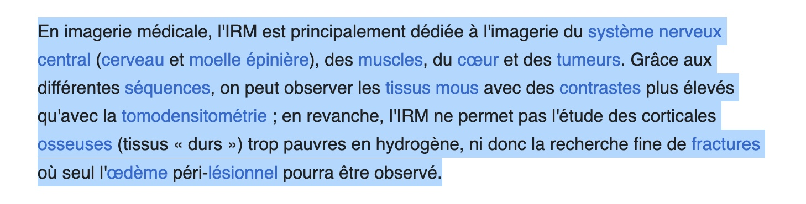
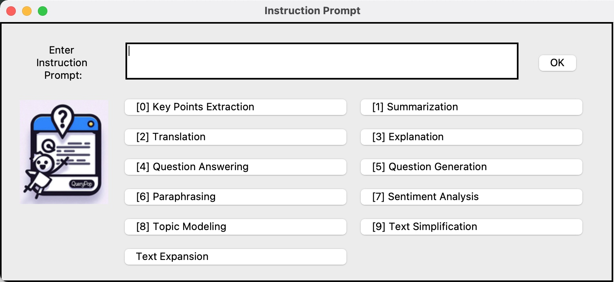

<p align="center">
  
</p>

# QueryPop 🎉

QueryPop is a Python application that sends selected text from the clipboard to a Large Language Model (LLM) for processing and displays the response in a user-friendly pop-up window. This application is designed for macOS and Windows and provides functionality to handle text queries, display results, and save responses. This avoids need to getting distracted from what your are reading.

## ✨ Features 

- **Clipboard Integration**: Automatically processes text from the clipboard.
- **LLM Integration**: Sends text to a Large Language Model (e.g., OpenAI) for processing. Accepts all OpenAI compatible API.
- **Pop-Up Display**: Shows responses or errors in a graphical pop-up window.
- **Markdown to HTML**: Converts markdown responses to HTML for enhanced readability.
- **Response Saving**: Saves responses to a specified directory with timestamps.

## 🛠️ Requirements  

- Python 3.11
- `pyperclip` - For clipboard interaction.
- `openai` - For OpenAI API integration.
- `tkinter` - For GUI pop-ups.
- `tkhtmlview` - For displaying HTML content in the GUI.
- `markdown2` - For converting markdown to HTML.
- `pillow` - For image display.

## 🚀 Installation 

1. **Clone the repository:**

   ```bash
   git clone https://github.com/drankush/QueryPop.git
   cd QueryPop
   ```

2. **Install the required Python packages:**

   ```bash
   pip install pyperclip openai tkhtmlview markdown2 pillow
   ```

##  ⚙️ Configuration

1. **API Details**: Set your API details in the `config.py` file. Accepts all OpenAI compatible API.

   ```python
   OPENAI_API_URL = "https://api.openai.com/v1"
   OPENAI_API_KEY = "your_openai_api_key"
   MODEL = "gpt-4o"
   ```

2. **Instruction Prompt**: Customize the instruction prompt by modifying the `INSTRUCTION_PROMPT` variable in the `config.py` file. 

   For example:
   ```python
    INSTRUCTION_PROMPTS = {
        0: "Key Points Extraction: 'Extract key points from the following text:'",
        1: "Summarization: 'Summarize the following text:'",
        2: "Translation: 'Translate the following text into Spanish:'",
        3: "Explanation: 'Explain the following text in detail:'",
        4: "Question Answering: 'Answer the following question based on the text:'",
        5: "Question Generation: 'Generate Questions based on the text:'",
        6: "Paraphrasing: 'Paraphrase the following text:'",
        7: "Sentiment Analysis: 'Determine the sentiment of the following text:'",
        8: "Topic Modeling: 'Identify the topics in the following text:'",
        9: "Text Simplification: 'Simplify the following text for easier understanding:'",
        10: "Text Expansion: 'Expand the following text on the topic being discussed:'"
    
    }
   ```

## 📋 Usage

1. **Select Text**: Copy the text you want to process to your clipboard.
   <p align="center">
     
   </p>

2. **Run the Application:**

   ```bash
   python querypop.py
   ```
   The application will show an Instruction prompt window.
   <p align="center">
     
   </p>
   - You can enter your custom prompt and press **OK**, which will be passed to the LLM along with text in the clipboard.
   - You can press 0-9 keys on your keyboard which will pass that Instruction prompt from the `config.py` along with the text in the clipboard.
   - Key bindings are available only from 0-9, if you have more instructions prompts, you will have to manually scroll and press the button.
   - If you wish to bypass this and want to hardcode a single instruction into the application, use `QueryPop v1`.
  

4. **Processing**: The application will automatically process the text and display `⚙️ Processing` in a pop-up window.
   <p align="center">
     
   </p>
5. **Final Output**: The application will display the result in the same pop-up window.
   <p align="center">
     
   </p>

## ❗ Error Handling

If no text is found in the clipboard, an error message will be displayed in a pop-up window.

## 💾 Saving Responses

Responses are saved as `.txt` files in the directory as defined in `QueryPop/responses`. 
If the directory does not exist, it will be created automatically. Each file is named with a timestamp for easy tracking.

## ⌨️ Customizing Key Bindings

To streamline the workflow, you can set up keyboard shortcuts to trigger the application after selecting text. 

### 🍏 On macOS:

1. **Create a Service in Automator**:
   - Open **Automator** and choose **Service**.
   - Set the service to receive **no input** in **any application**.
   - Add the **Run Shell Script** action.
   - Enter the following script, replacing `/path/to/querypop.py` with the path to your application script:

     ```bash
     /usr/bin/python3 /path/to/querypop.py
     ```

   - Save the service with a name like "Run QueryPop".

2. **Set a Keyboard Shortcut**:
   - Open **System Preferences** > **Keyboard** > **Shortcuts**.
   - Select **Services** on the left.
   - Find the service you created ("Run QueryPop") and add a shortcut by clicking **Add Shortcut**.
  
3. **Binding to Cmd/Ctrl+C**:
   - Note: macOS does not natively support binding the Cmd+C shortcut to a new function without overriding its default behavior. However, you can use a combination of other shortcuts or tools like Keyboard Maestro, BetterTouchTool to achieve similar functionality.

### 🪟 On Windows:

1. **Create a Shortcut**:
   - Right-click on your desktop and choose **New** > **Shortcut**.
   - Enter the path to your Python executable and the script, e.g.:

     ```bash
     C:\path\to\python.exe C:\path\to\querypop.py
     ```

   - Name the shortcut (e.g., "Run QueryPop").

2. **Set a Keyboard Shortcut**:
   - Right-click on the newly created shortcut and select **Properties**.
   - In the **Shortcut** tab, click on the **Shortcut key** field and press the desired key combination (e.g., `Ctrl + Alt + Q`).
   - Click **Apply** and **OK**.
  
3. ### To Bind the Script to Ctrl+C using AutoHotkey:
   - Install AutoHotkey if you haven't already.
   - Create a new script with the following content:
      ```ahk
      ^c::
      Send, ^c
      Run, C:\path\to\python.exe C:\path\to\querypop.py, , Hide
      return
      ```
      Replace `C:\path\to\python.exe` and `C:\path\to\querypop.py` with the actual paths to your Python executable and script.
   - Save the script and run it. Now, pressing Ctrl+C will trigger the script.
   
      **Note:** The `^c::` line specifies that the script should trigger when Ctrl+C is pressed. The `Send, ^c` line simulates the Ctrl+C key press, and the `Run` line executes the Python script. The `, , Hide` parameter hides the command prompt window.
  


## 🤝 Contributing

Feel free to fork the repository and submit pull requests. If you encounter any issues or have suggestions for improvements, please open an issue.

##  📜 License

This project is licensed under the MIT License. See the [LICENSE](LICENSE) file for details.

